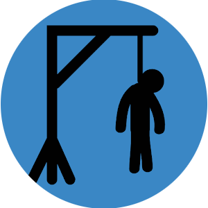

# 🕹️ Hangman - Flutter Game

A modern, mobile-friendly version of the classic Hangman game built using Flutter. Guess letters, uncover words, and avoid losing all your chances!

---

## 📱 Screenshots



| Game Start | Playing | Game Over |
|------------|---------|-----------|
|  |  |  |

---

## 🚀 Features

- 🎨 Beautiful animated UI with a liquid progress indicator
- 💡 Over 200+ uncommon English words
- 🔄 Restartable gameplay with score tracking
- 🔒 Local high score stored with `shared_preferences`
- 🎯 Responsive for both iOS and Android

---

## 🛠️ Tech Stack

- Flutter (Dart)
- `shared_preferences` for storing high scores
- `liquid_progress_indicator_ns` for the animated loading bar

---

## 📦 Installation

1. **Clone the repo**
   ```bash
   git clone https://github.com/yourusername/hangman-flutter.git
   cd hangman-flutter


2. **Install dependencies**

   ```bash
   flutter pub get
   ```

3. **Run the app**

   ```bash
   flutter run
   ```

---

## ✍️ Author

**Aadi Gupta**
[Portfolio Website](https://aadigupta.com) • [LinkedIn](https://linkedin.com/in/your-link) • [GitHub](https://github.com/yourusername)

---

## 📄 License

This project is licensed under the MIT License - see the [LICENSE](LICENSE) file for details.

